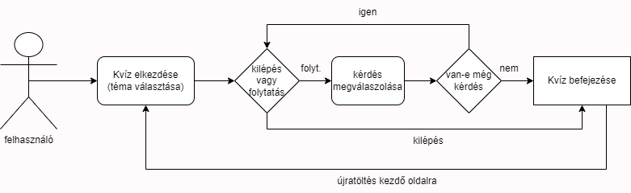

# Funkcionális specifikáció

## Jelenlegi helyzet leírása

## Követelménylista

## Jelenlegi üzleti folyamatok modellje

## Igényelt üzleti folyamatok modellje

## Használati esetek
A felhasználó kiválasztja a kvíz témáját és elkezdi annak megoldását. A kvíz megoldása folyamán bármikor ki lehet lépni. Amikor a felhasználó megválaszolt adott számú kérdést, a kvíz befejeződik és lehetőség van újbóli megoldására

## Képernyő tervek